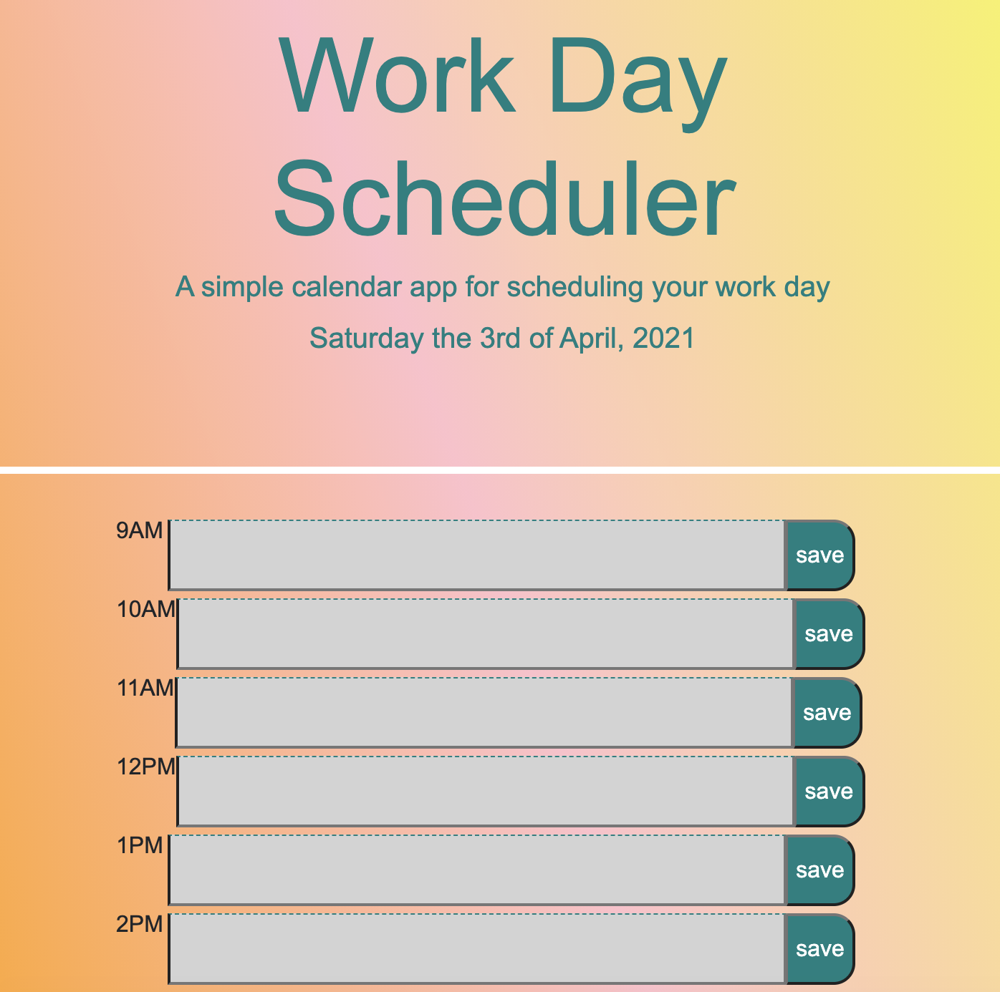

# Week-5-Homework: Work Day Scheduler

This is a planner application created with HTML, CSS, JavaScript and jQuery.

The current day is displayed at the top of the planner. The user is presented with timeblocks for standard business hours, color-coded to indicate whether the time is past, current, or future.
The 'save' buttons store entered events in localStorage.

This is the link to the deployed URL: [hosted-url](https://celestealexmoore.github.io/Week-5-Homework/)

This is my application:

